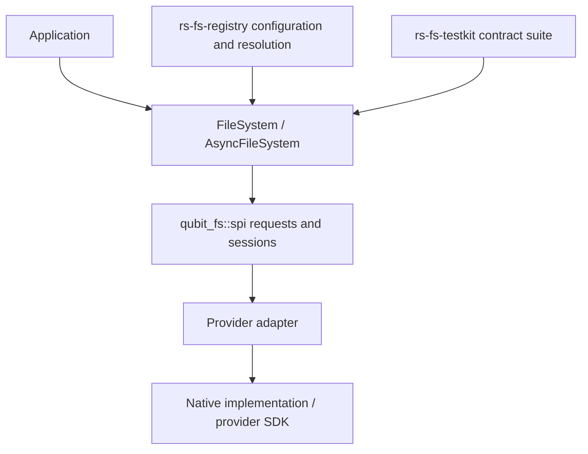
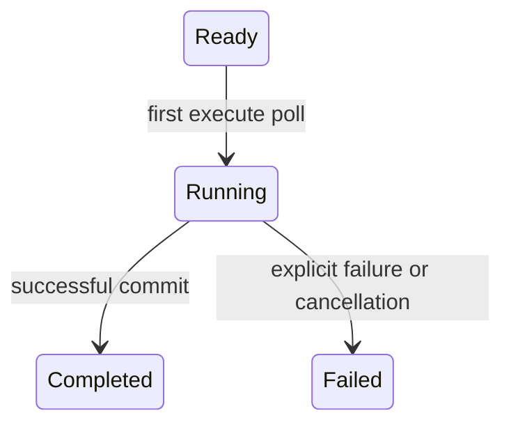

# Qubit FS architecture and recovery contracts

[中文设计](file_system_design.zh_CN.md) · [User guide](user_guide.md)

This document describes the 0.4 design. It separates application policy,
provider capabilities, publication facts, and resource ownership. Rust 1.94,
edition 2024, an empty default feature set, and opt-in `async` remain the baseline.

## Layers and ownership

The facade owns deterministic validation, limits, context enrichment, opened
identity checks, outcome validation, and bounded composite operations. The SPI
owns provider extension points. Adapters translate logical requests and native
results without inventing guarantees. Native libraries own OS/SDK behavior.
Registry owns provider selection and configuration, not filesystem algorithms.
Testkit exercises public facades with provider-owned observation hooks.

The core does not depend on a local backend, registry discovery, a network SDK,
or an executor. Public values are grouped by read/write/copy/directory/temp and
other domains. Private helpers belong to their owning domain. Synchronous and
asynchronous operations share proven policy rules, not a generic operation engine.

## Configured filesystems, names, and trust boundaries

A provider can create many configured filesystems with distinct roots, buckets,
endpoints or credentials. Identity and logical path form part of resource
identity; a `Path` alone cannot name an arbitrary cross-filesystem resource.
A registry resolution binds a facade, logical path, and canonical URI.

`Path` supports hierarchical and literal object-key semantics. Facades validate
accepted absolute/relative forms and declared component/path limits. Host-path
conversion belongs to the local adapter, including non-UTF-8 and percent-escape
handling. Core parsing cannot enforce a native root authority by itself.

`Uri` is secret-free canonical text interpreted with filesystem context.
Username-only authority is allowed; passwords, sensitive query fields and
fragments are rejected. `ConnectionUri` is configuration ingress and retains
controlled access to original text while redacting formatting. Explicit policies
can add sensitive names but cannot weaken the standard floor. Provider-private
credentials must be consumed before canonical URI construction. Unredacted text
must not flow into diagnostics, metadata, serialization or cache keys.

## Properties, primitive dispatch, and envelopes

`FileSystemSpi::properties()` and its async counterpart return
`ProviderProperties`: stable identity, `ProviderOperations`, declared
capabilities, limits, path constraints and symlink policy. The facade captures
this once and derives application-facing `FileSystemProperties`. Properties are
immutable and reading them performs no I/O.

The declared capability dependency graph is:

| Derived capability | Required base capability |
| --- | --- |
| `RangeRead`, `ConditionalRead`, `ChecksumValidation` | `Read` |
| `Append`, `ConditionalWrite`, `AtomicReplace`, `DurableWrite` | `Write` |
| `RecursiveDelete`, `ConditionalDelete` | `Delete` |
| `AtomicRename`, `DurableRename` | `Rename` |
| `ServerSideCopy`, `AtomicFileCopy`, `AtomicTreeCopy`, `DurableFileCopy`, `DurableTreeCopy` | `Copy` |

This table expands to the sixteen pairs in `CAPABILITY_DEPENDENCIES`. A
conditional derived capability requires a supported base; a guaranteed derived
capability requires a guaranteed base. `ProviderProperties` is the provider
declaration, while `FileSystemProperties` is the facade's validated effective
view. `ProviderOperations` selects primitive dispatch; capabilities describe
semantic guarantees.

Concrete primitive availability and effective capabilities are separate.
Dispatch consults `ProviderOperation`; a facade composite can be available
without a native fast path. A regular-file stream copy uses eligible reader and
writer primitives when native copy is absent or explicitly declines without
effects. Advertising a capability without its required primitive is rejected.
Optional/required request guarantees are still checked for each operation.

Requests under `qubit_fs::spi` carry facade-validated paths and resolved options.
Providers return envelopes rather than constructing application handles.
`stat` returns `FsResult<StatResponse>`: path-bound metadata. The facade checks
the response path before exposing `FileMetadata`. Opened readers, writers,
directory streams and temporary resources similarly carry identity information
that is verified before conversion into a facade-owned handle.

The pipeline is: validate request → check capabilities and limits → dispatch
provider primitive → validate identity/outcome → enrich typed results. Invalid
provider success is a contract violation, not permission to invent a successful
fallback or repeat an operation that may already have published.

## Publication and failure facts

Publication, source/staging cleanup, and recovery-handle ownership are distinct.
Errors preserve operation, provider and path context. Stream errors recover
embedded filesystem context without requiring source-message formatting.
`exists` maps only `NotFound` to false.

Writer opening has a deliberately conservative rule:

| Opening evidence | Whole write | Whole copy |
| --- | --- | --- |
| Facade rejection before provider I/O | `NotPublished` | `Unchanged` |
| Explicit `Unchanged`, no indeterminate kind/effect | `NotPublished` | `Unchanged` |
| Missing effect, `Applied`, `PartiallyApplied`, or uncertainty | `Indeterminate` | `Indeterminate` |

An `Indeterminate` error kind wins over a conflicting unchanged annotation.
Opening effects can concern parent creation or staging, so `Applied` does not
prove complete file publication. Original error effects remain available for
diagnostics. `AlreadyExists + Skip` succeeds only with explicit unchanged proof.
SPI default unsupported opens are unchanged because they perform no I/O. An
adapter may annotate pure path/option conversion failures, but not unknown
native I/O solely from an error name.

This mapping applies only to opening. Commit failures retain their typed state,
including `RetryableNotPublished`, `NotPublished`, `Published`, or
`Indeterminate`. Copy additionally models partial publication. A known published
result remains published when later guarantee checking or cleanup fails.
Neither the absence of a writer nor successful cleanup proves no target effect.
No write/copy failure triggers an implicit retry.

## Owning asynchronous whole-file writes

The public entry point consumes `Path`, `Vec<u8>`, and `WriteOptions`, returning
`Result<AsyncWriteAllOperation, AsyncWriteAllOperationFailure>`. The operation
owns a cheap filesystem clone and has no borrowing lifetime. `filesystem()` and
`path()` permit reconciliation when opening did not return a writer.

Only `Ready` may execute. Dropping an unpolled execution future leaves it ready.
Cancellation after polling records `Failed(Indeterminate)`, confirmed bytes, and
any opened writer. An opening cancelled before a writer is returned still needs
reconciliation. Repeated execution returns `InvalidState` without changing
historical facts or calling the provider.

At first poll the payload moves from the operation into the execution future.
It is released on completion or cancellation; `Ready` retains it. Confirmed byte
counts include only completed successful writes, including short writes, never
an in-flight or failed call. Success snapshots the count before releasing the
committed writer. Failures retain a relevant writer, including published failures
that still require cleanup. Taking the writer transfers responsibility; later
recovery does not rewrite the operation's historical snapshot. Debug omits payload
and provider-session contents. The old async `write_all` and failure wrapper are
removed; synchronous `write_all` retains its natural synchronous ownership model.

Async copy follows the same ownership principle with its own copy statistics.
The two operations share opening evidence rules but keep domain-specific state.
Drop does not start a runtime or confirm asynchronous network cleanup. Applications
must keep recovery ownership through explicit cleanup and preserve both primary
and cleanup errors.

## Copy, listing, deadlines, and guarantees

Native `try_copy` may complete, explicitly decline without effects, or fail.
Only the first two outcomes allow success or eligible fallback. The fallback is
bounded regular-file streaming, not a replacement for server-side/atomic/durable
copy, tree copying, or a changed symlink policy. Requirements that cannot be
satisfied are rejected before side effects where determinable.

Copy deadlines are cooperative cumulative budgets starting at operation
construction. Checks surround provider work and stream stages. They do not
interrupt an arbitrary pending provider future. Provider errors stay primary;
timeout after confirmed publication preserves publication and successful stats.

Directory streams are incremental and can fail after earlier entries. They are
not snapshots. `Subtree` preserves hierarchical boundaries. `LiteralPrefix`
compares raw object-key text relative to `ListScope::Path`, or complete logical
keys for `ListScope::Namespace`; it does not decode or normalize keys. List/copy symlink overrides remain scoped to each operation.

Atomicity and durability are independent. `WriteOutcome`, `RenameOutcome`,
and `CopyOutcome` expose durability facts alongside applicable atomicity,
publication/copy method and metadata. `PersistOutcome` reports publication and
cleanup without a durability field; persistence success does not establish durability. Required
guarantees are validated both before dispatch where possible and after outcomes.
Rename remains a same-filesystem primitive, not a cross-filesystem move protocol.

## Temporary resources

Temporary file/directory handles own cleanup responsibility and expose explicit
`cleanup`, `keep`, and `persist`. Child creation validates relative paths and
prevents escaping the owned temporary namespace. Drop cleanup is best effort
where supported and is not a substitute for confirmation.

| Persist failure state | Target fact | Source responsibility |
| --- | --- | --- |
| `NotPublished` | Not published | Retained |
| `NotPublishedSourceReleased` | Not published | Released |
| `PublishedSourceRetained` | Published | Retained |
| `PublishedSourceReleased` | Published | Released |
| `Indeterminate` | Uncertain | Must reconcile |

`publication_target()` preserves the confirmed target even if a later request
names another target. Lifecycle validation cannot erase earlier publication.
`PersistOutcome` records actual publication and cleanup information; source
release and target rollback must never be conflated.

## Verification and maintenance

Core tests cover opening evidence and Skip parity, short writes and failures,
success counts, empty payloads, cancellation stages, repeated execution and
recovery ownership. Pending tests use controlled polling rather than sleeps.
Testkit's async write catalog requires owning-operation, repeated-execute, and
open/write/flush/commit cancellation evidence. Providers must acknowledge a
stage through `WriteCancellationProbe`. Missing probes for advertised write
capability remain `Unverified`; strict completeness fails. Sync catalogs exclude
async requirements.

Bilingual complete guide examples match an independent Cargo fixture exactly.
The fixture exercises local success and retained async recovery; package checks
verify local document links. Rustdoc builds and Markdown compilation are separate
checks. Default/all-feature tests, downstream integration, benchmarks, fuzz
compilation and actual coverage provide distinct evidence. Coverage thresholds
must not be lowered to hide missing behavior. A green subset is not a claim of
full platform or repository-wide compliance.

The maintenance boundary is targeted policy/lifecycle helpers and documented
public contracts. No generic all-operation engine, provider runtime, or native
I/O algorithm rewrite is introduced by the recovery work.

## Listing scopes and bounded reads

Pass `ListScope::Path(path)` to list a hierarchical directory or a raw flat-key
prefix. Use `ListScope::Namespace` to list the entire configured flat namespace;
it is rejected for hierarchical filesystems, whose root is `ListScope::Path(Path::root())`.
`Path` still rejects empty strings. Namespace does not permit access beyond the
configured filesystem, and cannot be used to open, stat, or write a resource.

For flat keys, `LiteralPrefix` is relative to the selected scope. A root `folder/`
and filter `a` match `folder/a` and `folder/ab`. A root `folder` also matches
`folderish`; no separator is inserted and no key text is normalized. Namespace
filters match complete logical keys. The combined root/filter text is checked
against the provider's path-text limit before opening a stream.

Listing deadlines start when the stream is constructed and are checked before
and after each provider call. A successful entry or EOF arriving at the deadline
is rejected; a real provider failure retains its category and source. Checks are
cooperative and cannot interrupt a permanently pending provider future. Creating
and dropping an unpolled next-entry future does not change stream state.

`read_prefix` opens once and consumes at most the requested prefix without an
extra stat. It inserts or narrows a provider range only for **Guaranteed**
`RangeRead`, no checksum request, a positive prefix length, and representable
provider limits. Original options are validated first. Conditional or unsupported
range capabilities still permit sequential prefix reads. BestEffort checksum
preserves the original request; Required checksum is rejected with
`RequirementNotMet` because a prefix cannot prove complete checksum validation.
Use a complete `read_all` when that guarantee is needed. Return and consumption
bounds do not promise an identical bound on provider network prefetch.

## Opening failures and recovery in 0.6

`open_writer`, `create_temp_file`, and `create_temp_directory` return
`OpenFailure<R>` in both facades. `Preflight` and `ProviderOpen` failures have no
recovery session. `OutcomeValidation` means a provider returned a session with an
invalid identity: the error owns a `RejectedWriter`, `RejectedAsyncWriter`,
`RejectedTempResource`, or `RejectedAsyncTempResource`. These handles expose only
explicit abort/cleanup, never writing, commit, keep, persist, or a raw session.
Keep the error or transfer its session with `take_recovery`; converting it into
an ordinary `FsError` would lose recovery responsibility and is not provided.

Cleanup errors and polled-future cancellation retain the session and record
`RecoveryCleanupState::Indeterminate`; an unpolled cleanup future changes nothing.
A confirmed cleanup records `Completed`; another cleanup returns `InvalidState`
without provider I/O. An indeterminate abort is not confirmation. Dropping a
rejected handle does not initiate cleanup or `cancel_on_drop`. Cleanup uses the
session's actual ownership, not an unvalidated diagnostic path. Public cleanup
context contains only the configured provider and known request path; a temporary
request without a parent has no invented path. Preserve the original failure and
any cleanup error together.

Whole-write and copy recovery uses `WriterRecovery` / `AsyncWriterRecovery`:
match `Opened` for a validated writer and `Rejected` for cleanup-only authority.
Use `recovery`, `recovery_mut` where available, and `take_recovery` instead of the
removed writer-only accessors. Synchronous `WriteAllFailure::state()` and
`written_bytes()` capture immutable failure facts, including short writes and
exact commit states; abort or transferring recovery never changes those facts.
The failure's `into_parts` returns error, state, confirmed bytes, and recovery.
A copy collision during opening can count as Skip only when the provider failed with proven
unchanged effects and no rejected session. Invalid opened identities remain
indeterminate failures.

The core cannot retain a session a provider has not returned. Providers remain
responsible for resources created internally during failed or cancelled opening.

## Read windows and allocation limits

`ReadOptions::validate()` rejects explicit offset + length overflow as
`InvalidOptions` before capability checks, prefix optimization, or provider I/O.
An omitted offset means zero. A zero-length request still opens or checks the
resource; missing resources and permission failures remain errors. Windows at or
beyond EOF are empty, and windows crossing EOF return the available suffix.
Returned metadata describes the full resource, not the window or a snapshot.

Both sync and async `read_all` and `read_prefix` use fallible geometric buffer
growth. Metadata is a hint, not an allocation instruction: an enormous hint does
not reserve the whole object. Reservation failures return `ResourceLimitExceeded`
with the allocation error as source. `read_all` may consume one extra byte to
prove the limit was exceeded; `read_prefix` never probes past its prefix limit.
These are returned-length and consumption bounds, not process RSS bounds or
limits on provider/network prefetch. The local provider advertises conditional
range support, so automatic prefix narrowing still requires a provider advertising
`RangeRead` as Guaranteed.
