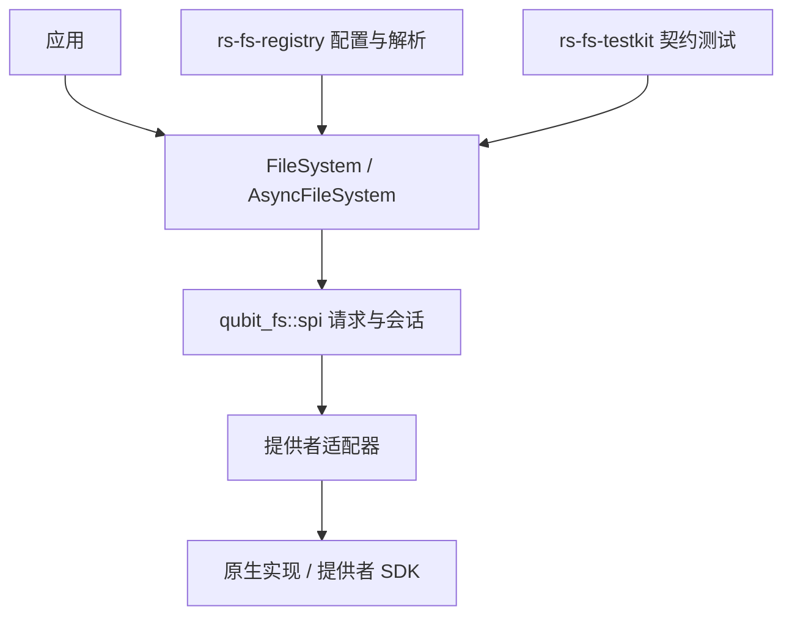
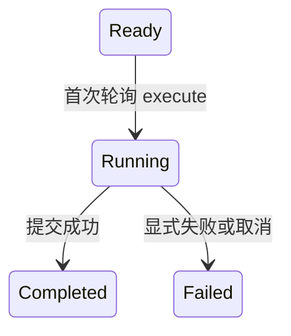

# Qubit FS 架构与恢复契约

[English design](file_system_design.md) · [用户指南](user_guide.zh_CN.md)

本文描述 0.8 的设计，明确区分应用策略、提供者能力、发布事实和资源所有权。
基线为 Rust 1.94、edition 2024；默认 feature 集为空，异步 API 通过 `async` 显式启用。

## 分层与所有权

门面负责确定性校验、限制、错误上下文、打开结果身份检查、outcome 校验和有界组合操作。
SPI 定义扩展点，适配器转换逻辑请求与原生结果，不虚构保证；原生库负责操作系统或 SDK 行为。
registry 负责选择提供者和配置，不接管文件系统算法。testkit 通过公共门面操作，并借助提供者
自己的观察探针获取证据。

核心不依赖本地后端、registry 发现机制、网络 SDK 或执行器。公共值类型按 read/write/copy/
directory/temp 等领域组织，私有辅助类型归属对应领域。同步与异步实现共享能够证明一致的
策略规则，各自保留操作状态；不引入通用操作引擎。

## 已配置文件系统、名称与信任边界

同一提供者可以创建根目录、bucket、endpoint 或凭据不同的多个文件系统。资源身份包含文件
系统身份和逻辑路径；单独的 `Path` 不能表示任意跨文件系统资源。registry 解析将门面、逻辑
路径和规范 URI 绑定在一起。

`Path` 区分层级路径与保留原始文本的对象键语义。门面校验绝对／相对形式及路径、分量限制。
本机路径转换由 local adapter 处理，包括非 UTF-8 和百分号转义；核心路径解析无法单独落实
本机根目录权限边界。

`Uri` 是结合文件系统上下文解释的规范文本，不携带 secret。它允许仅含用户名的 authority，
拒绝密码、敏感查询字段和 fragment。`ConnectionUri` 用于配置入口，在受控边界保留原文访问
能力，但输出时脱敏。显式策略可增加敏感名称，不能削弱标准底线。提供者私有凭据必须在构造
规范 URI 前消费；未脱敏文本不能进入诊断、metadata、序列化或缓存键。

## 属性、原语分派与返回封装

`FileSystemSpi::properties()` 及异步版本返回 `ProviderProperties`，包含稳定身份、
`ProviderOperations`、声明能力、限制、路径约束和符号链接策略。门面捕获该快照并推导面向
应用的 `FileSystemProperties`。属性保持不可变，读取不执行 I/O。

声明的 capability 依赖关系如下：

| 派生 capability | 必需的基础 capability |
| --- | --- |
| `RangeRead`、`ConditionalRead`、`ChecksumValidation` | `Read` |
| `Append`、`ConditionalWrite`、`AtomicReplace`、`DurableWrite` | `Write` |
| `RecursiveDelete`、`ConditionalDelete` | `Delete` |
| `AtomicRename`、`DurableRename` | `Rename` |
| `ServerSideCopy`、`AtomicFileCopy`、`AtomicTreeCopy`、`DurableFileCopy`、`DurableTreeCopy` | `Copy` |

这张表展开后正好对应 `CAPABILITY_DEPENDENCIES` 中的 16 对关系。Conditional 派生能力
要求基础能力至少可支持；Guaranteed 派生能力则要求基础能力也是 Guaranteed。
`ProviderProperties` 是 provider 的声明，`FileSystemProperties` 是门面校验后对应用
暴露的有效视图。`ProviderOperations` 决定原语分派，capability 描述语义保证。

具体原语是否存在与有效能力是不同事实。分派查看 `ProviderOperation`；某个组合操作可以
在没有原生 fast path 时仍然可用。例如，原生复制不存在或明确无副作用地拒绝后，普通文件
复制可使用符合条件的 reader/writer 原语。声明能力却缺少必需原语会被拒绝，每次操作仍需
校验请求中的可选和 required 保证。

`qubit_fs::spi` 请求携带经门面校验的路径和已解析选项。提供者返回封装对象，而不是自行
构造应用句柄。`stat` 返回 `FsResult<StatResponse>`，将 metadata 与所描述路径绑定，
门面检查路径后才暴露 `FileMetadata`。reader、writer、目录流和临时资源的打开结果同样
携带身份信息，通过校验后才能转为门面拥有的句柄。

调用流程为：校验请求 → 检查能力和限制 → 调用提供者原语 → 校验身份与 outcome → 补充
类型化结果的上下文。提供者返回不合法的成功结果属于契约违例，不能因此虚构成功的 fallback，
也不能重复执行可能已经发布的操作。

## 发布事实与失败状态

发布、源／暂存清理和恢复句柄所有权分别建模。错误保留 operation、provider 和路径上下文。
流错误恢复内部携带的文件系统上下文，不依赖格式化底层错误消息。`exists` 只将 `NotFound`
转换为 false。

打开 writer 失败采用保守规则：

| 打开证据 | 整次 write | 整次 copy |
| --- | --- | --- |
| 调用提供者前的门面拒绝 | `NotPublished` | `Unchanged` |
| 明确 `Unchanged`，且没有不确定 kind/effect | `NotPublished` | `Unchanged` |
| 缺失 effect、`Applied`、`PartiallyApplied` 或不确定证据 | `Indeterminate` | `Indeterminate` |

`Indeterminate` 错误类型优先于矛盾的 unchanged 注记。打开步骤的副作用可能是创建父目录
或暂存资源，因此 `Applied` 不能证明请求数据已完整发布。原始 effect 继续保留供诊断。
`AlreadyExists + Skip` 只有明确的 unchanged 证据才成功。默认不支持的 SPI 打开实现不执行
I/O，因此标记 unchanged。适配器可以注记纯路径／选项转换失败，不能仅凭错误名称注记未知
原生 I/O。

该规则仅用于打开阶段。提交继续保留 `RetryableNotPublished`、`NotPublished`、`Published`
或 `Indeterminate` 等阶段状态；copy 还可表示部分发布。后续保证校验或清理失败，不能抹去
已确认的发布。没有 writer 或清理成功均不能证明目标没有副作用。write/copy 失败不会触发
隐式重试。

## 拥有请求的异步整文件写入

公共入口消费 `Path`、`Vec<u8>` 和 `WriteOptions`，返回
`Result<AsyncWriteAllOperation, AsyncWriteAllOperationFailure>`。operation 持有低成本的
文件系统 clone，不带借用生命周期。打开未返回 writer 时，`filesystem()` 和 `path()`
仍可用于核查。

只有 `Ready` 允许执行。丢弃未轮询的执行 future 仍保持 Ready；执行开始后取消则记录
`Failed(Indeterminate)`、已确认字节数和已取得的 writer。打开期间取消即便没有 writer，
也需要核查。重复执行返回 `InvalidState`，不改变历史事实，也不再次调用提供者。

首次 poll 将数据从 operation 移入执行 future，完成或取消时释放；Ready 状态继续持有数据。
计数只包含成功写调用返回的确认字节，包括短写，不猜测 Pending 或错误调用的写入量。
成功时先保存计数，再释放已提交 writer。失败时保留必要的 writer，已发布但仍需清理的失败
也不例外。取走 writer 即转移恢复责任；后续恢复不改写 operation 的历史快照。Debug 不输出
payload 或 provider session。旧异步 `write_all` 和错误包装已删除；同步 `write_all`
保留自然的同步所有权模型。

异步 copy 遵循相同的所有权原则，并保留自己的复制统计。两种操作共享打开证据判断，不合并
领域状态。Drop 不启动运行时，也不确认异步网络清理；应用必须在显式清理期间保留恢复所有权，
同时保存主错误和清理错误。

## 复制、列举、期限与保证

原生 `try_copy` 可以完成、明确无副作用地拒绝，或失败。前两种结果才允许直接成功或执行
符合条件的 fallback。fallback 是有界的普通文件流式传输，不能替代服务端／原子／持久复制，
不能处理目录树复制或改变符号链接策略。在可静态判定时，不可能满足的要求应在副作用前拒绝。

copy deadline 是从 operation 构造起累计的协作式预算，在提供者调用和流式阶段前后检查。
它不能打断任意 Pending future。提供者错误仍为主错误；已确认发布后的超时保留发布事实和
成功统计。

目录流逐步返回条目，可能在已经处理部分条目后失败，不提供快照保证。`Subtree` 保留层级
边界；`LiteralPrefix` 相对于 `ListScope::Path` 匹配原始对象键文本，
对于 `ListScope::Namespace` 则匹配完整逻辑键，不解码或规范化键。
list/copy 的符号链接覆盖策略仅对本次操作生效。

原子性与持久性独立。`WriteOutcome`、`RenameOutcome`、`CopyOutcome` 报告实际 durability，
以及适用的原子性、发布／复制方法和 metadata。`PersistOutcome` 报告发布与清理，没有
durability 字段，持久化成功不能证明已完成持久同步。
required 保证在可行时于分派前检查，完成后再根据 outcome 校验。rename 是同一文件系统的
原语，不是跨文件系统 move 协议。

## 临时资源

临时文件和目录句柄拥有清理责任，提供显式 `cleanup`、`keep`、`persist`。创建子资源时校验
相对路径，防止逃出所拥有的临时命名空间。支持的 Drop 清理仅尽力执行，不能替代完成确认。

| 持久化失败状态 | 目标事实 | 源责任 |
| --- | --- | --- |
| `NotPublished` | 未发布 | 保留 |
| `NotPublishedSourceIndeterminate` | 未发布 | 变更权限不确定，只能只读核查 |
| `NotPublishedSourceCleanupRequired` | 未发布 | 只允许清理残留资源 |
| `NotPublishedSourceReleased` | 未发布 | 已释放 |
| `PublishedSourceRetained` | 已发布 | 保留 |
| `PublishedSourceIndeterminate` | 已发布 | 变更权限不确定，只能只读核查 |
| `PublishedSourceReleased` | 已发布 | 已释放 |
| `Indeterminate` | 不确定 | 需要核查 |

Provider 报告本次尝试的 publication，门面则保留整个生命周期的恢复快照。例如，资源此前
已经发布后，重试在 provider I/O 前被拒绝并不构成本次发布，但门面错误仍可能保留先前的
`PublishedSource*` 状态和 `publication_target()`。反过来，provider 对后续调用报告
`NotPublished` 也不能抹去历史目标。即使后续请求使用不同目标、路径校验失败、cleanup
失败或异步生命周期 future 被取消，已经确认的目标仍被保留。源资格不确定后，普通错误
不能把它改成可清理或重新拥有；路径校验失败也不能恢复所有权。`PersistOutcome` 记录实际
发布与清理信息；源释放不能与目标回滚混为一谈。

## 验证与维护

核心测试覆盖打开证据和 Skip 的同步／异步一致性、短写与失败、成功计数、空数据、取消阶段、
重复执行和恢复所有权。Pending 测试使用可控 poll，不依赖 sleep。testkit 的异步写入目录
要求 owning-operation、repeated-execute 和 open/write/flush/commit 取消证据。
提供者必须通过 `WriteCancellationProbe` 确认阶段到达；声明写能力却缺失探针时保持
`Unverified`，严格完整性检查失败。同步目录不登记异步要求。

双语指南中的完整示例与独立 Cargo fixture 精确匹配。fixture 验证本地成功流程和异步恢复
所有权，源包检查验证文档相对链接。Rustdoc 构建与 Markdown 编译分别验收。默认／全 feature
测试、下游集成、benchmark、fuzz 编译和实际覆盖率提供不同证据。不能降低覆盖率门槛掩盖
行为缺口；部分检查通过不等于全部平台或全仓库合规。

维护范围集中在策略／生命周期辅助逻辑和已声明的公共契约。恢复改造不引入通用操作引擎、
提供者运行时，也不重写原生 I/O 算法。

## 列举范围与有界读取

列举层级目录或平面键前缀时，传入 `ListScope::Path(path)`；列举整个已配置的平面
命名空间时，传入 `ListScope::Namespace`。层级文件系统拒绝 Namespace，列举其根目录
应使用 `ListScope::Path(Path::root())`。`Path` 仍拒绝空字符串。Namespace 不会扩大
配置的文件系统边界，也不能用来打开、查询属性或写入资源。

平面键的 `LiteralPrefix` 相对于所选范围匹配。例如根为 `folder/`、过滤器为 `a`
时匹配 `folder/a` 和 `folder/ab`；根为 `folder` 时还会匹配 `folderish`。
匹配过程不补分隔符，也不规范化键文本。Namespace 的过滤器匹配完整逻辑键。
打开流之前，会按 provider 的路径文本上限检查根与过滤器合并后的长度。

列举 deadline 从目录流构造完成时开始计算，每次调用 provider 前后都会检查。
到期后收到的成功条目或 EOF 会被拒绝；实际 provider 错误保留原类型和错误链。
这是一种协作式预算，不能中断永久 Pending 的 future。只构造再丢弃未经 poll 的
next-entry future，不会改变流状态。

`read_prefix` 只打开一次 reader，不额外 stat，消费字节数不超过前缀上限。
只有 `RangeRead` 为 **Guaranteed**、未请求 checksum、前缀长度为正，且范围可表示
并符合 provider 上限时，才会自动添加或收紧 range；原始选项总是先校验。
Conditional 或不支持范围读取的 provider 仍可顺序读取前缀。BestEffort checksum
保留原请求；Required checksum 会返回 `RequirementNotMet`，因为仅读取前缀不能确认
完整校验。需要该保证时使用完整的 `read_all`。返回和消费上限不等于网络预取量保证。

## 0.8 的打开失败与恢复协议

同步、异步门面的 `open_writer`、`create_temp_file` 和 `create_temp_directory`
均返回 `OpenFailure<R>`。`Preflight` 和 `ProviderOpen` 阶段没有可交回的会话；
`OutcomeValidation` 表示 provider 已返回会话，但身份校验失败。此时错误持有
`RejectedWriter`、`RejectedAsyncWriter`、`RejectedTempResource` 或
`RejectedAsyncTempResource`，仅允许显式 abort/cleanup，不提供写入、commit、keep、
persist 或原始 session。应用应保留错误，或用 `take_recovery` 接管会话；库不提供会
丢失恢复责任的普通 `FsError` 转换。

清理失败或已轮询的清理 future 被取消后，会话仍保留，清理状态变为
`RecoveryCleanupState::Indeterminate`；丢弃未轮询的 future 不改变状态。
确认清理完成后状态为 `Completed`，再次清理只返回 `InvalidState`，不调用 provider。
不确定的 abort 结果不算完成确认。隔离句柄的 Drop 不启动清理，也不调用
`cancel_on_drop`。清理必须依据 session 实际拥有的资源，不能依据未校验的诊断路径。
公开清理错误只使用已配置的 provider 和已知请求路径；没有 parent 的临时请求不伪造路径。
主失败和清理错误应同时保留。

整文件写入和复制通过 `WriterRecovery` / `AsyncWriterRecovery` 交回资源：
`Opened` 是已验证 writer，`Rejected` 只有清理权限。用 `recovery`、适用时的
`recovery_mut` 及 `take_recovery` 替代旧的 writer 专用访问器。
同步 `WriteAllFailure::state()` 和 `written_bytes()` 保存失败时的事实，包括短写确认
字节数和确切提交状态；abort 或取走会话都不改写历史。`into_parts` 返回错误、状态、
已确认字节数和恢复会话。对于打开阶段的 copy 碰撞，只有 provider 打开失败、明确证明无副作用且没有隔离会话
时，才能把碰撞按 Skip 处理；打开身份违例仍是结果不确定的失败。

provider 尚未交回的会话无法由核心接管。打开失败或取消之前在 provider 内部创建的资源，
仍由 provider 负责保留和回收。

## 读取窗口与分配上限

`ReadOptions::validate()` 在能力检查、前缀优化和 provider I/O 之前拒绝显式
 offset + length 溢出，错误为 `InvalidOptions`；未提供 offset 时按零计算。
零长度请求仍检查或打开资源，不能吞掉不存在、权限等错误。到达或超过 EOF 的窗口为空，
跨越 EOF 时返回可读取的后缀。metadata 描述完整资源，不表示窗口大小，也不承诺快照。

同步、异步 `read_all` 和 `read_prefix` 共用可失败的几何扩容缓冲。metadata 只是提示，
即使长度极大也不会据此预分配整份对象。分配失败返回 `ResourceLimitExceeded`，并保留
底层分配错误 source。`read_all` 可以多读一个字节确认超限；`read_prefix` 不读取前缀
上限以外的探测字节。这些上限约束返回长度和消费量，不等于进程 RSS 或 provider／网络
预取上限。本地 provider 的范围能力为 Conditional，自动缩小前缀请求仍只对声明
Guaranteed `RangeRead` 的 provider 生效。
